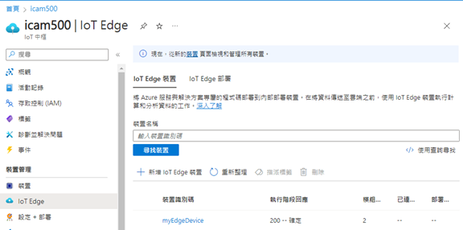
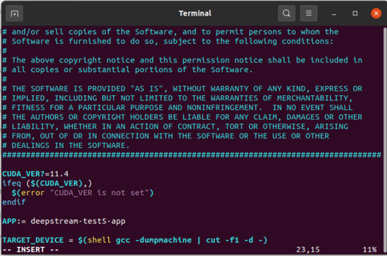
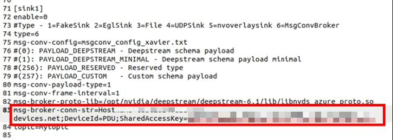
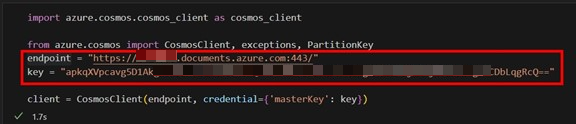

# Edge-Based Pedestrian Detection and Cloud Monitoring System

## Introduction

This project is focused on enhancing pedestrian safety by deploying an advanced detection system on edge devices. Operating at 30 FPS, the system streams video in real-time using the RTSP protocol. The Video Storage Toolkit (VST) is employed for efficient video stream management, while Azure IoT Hub provides robust cloud-based monitoring. By combining edge computing with cloud-based oversight, this project enables seamless access and monitoring of system resources and performance, paving the way for a more secure and efficient approach to pedestrian detection and monitoring.

## Jetson Platform and OS Compatibility

This project is compatible with the NVIDIA Jetson platform. The following steps outline the installation process for DeepStream SDK, VST, and Azure IoT Hub.

### DeepStream SDK Installation

Follow the steps below to install DeepStream 6.1 on your Jetson device:

1. **Install Jetson SDK Components**
2. **Install Dependencies**
3. **Install the DeepStream SDK**
4. **Run `deepstream-app` (the reference application)**

For detailed installation instructions, refer to the [DeepStream Quickstart Guide](https://docs.nvidia.com/metropolis/deepstream/6.1/dev-guide/text/DS_Quickstart.html).

### VST (Video Storage Toolkit) Installation

The Video Storage Toolkit (VST) is essential for managing video streams.

To install VST with Metropolis Microservices for Jetson:

Please refer to the [Video Storage Toolkit Quickstart Guide](https://docs.nvidia.com/moj/setup/quick-start.html) install.

1. **Install Platform Services**
2. **Install Application Bundle**
3. **Run IVA Application**

To start the application, navigate to the `ai_nvr` directory and run:

```bash
cd ai_nvr
```
- If on Orin AGX:
    ```bash
    sudo docker compose -f compose_agx.yaml down --remove-orphans
    ```
- If on Orin NX16:
    ```bash
    sudo docker compose -f compose_nx.yaml up -d --force-recreate
    ```
Now you should be able to test VST and use it successfully

### Azure IoT Hub Setup
To integrate Azure IoT Hub for cloud-based monitoring:

1. **Create an Azure IoT Hub**

   For detailed instructions, refer to the [Create an Azure IoT hub](https://learn.microsoft.com/en-us/azure/iot-hub/create-hub?tabs=portal).
   
2. **Create an IoT Edge Device**

   Login to Azure IoT Hub, select "IoT Edge" from the left menu, and create a new IoT Edge device.  
   After creation, the device will appear in the device list.

   

   You can view the detailed information of the device, such as the primary connect string connect string.

   

   **Note:** You need to obtain "primary connect string" of the device and paste it into the config file.

   Update  config file: `./deepstream-pedestrian_detection/configs/test5_config_file_src_infer_azure_iotedge.txt`

   ```bash
   msg-broker-conn-str=”primary connect string”
   ```

3. **Azure Cosmos DB**

   Since Azure IoT Hub is not a persistent storage solution, a solution needs to be developed to periodically extract data from IoT Hub
   and save the data to a persistent storage service, such as Azure Cosmos DB.

   For detailed instructions, refer to the [Create an Azure Cosmos DB](https://learn.microsoft.com/en-us/azure/cosmos-db/nosql/quickstart-portal).

## How to Run

1. **Download and Enter the Project Directory**

   Clone the repository and navigate to the project directory:

   ```bash
   git clone https://github.com/RENGJEY/pedestrian-detection-system
   cd pedestrian-detection-system/deepstream-pedestrian_detection
   ```

2. **Set the CUDA version in the Makefile**

    modify`./deepstream-pedestrian_detection/configs/Makefile`

    You can use the 'jtop' command to find the CUDA version first.

    

3. **Execute the command**

    ```bash
   sudo make
   ```

4. **Simple test of video inference for pedestrian detection**

    ```bash
   ./deepstream-test5-app -c configs/ test5_config_file_src_infer.txt -p 1 -t
   ```

5. **Streaming image inference for pedestrian detection and integrate into Azure IOT Center**

    Modify the config file. Please fill in the source, sink block, etc. correctly.
    
    If you want to use kafka or Azure MQTT, you need to add the connection string to the config file, as shown in the figure.

    

    Execute the command

    ```bash
   ./deepstream-test5-app -c configs/test5_config_file_src_infer_azure_iotedge.txt -p 1 -t
   ```

6. **Add RTSP port to VST**

    Add a detected RTSP port in VST `rtsp://localhost:8554/dstest`

    

7. **Azure IoT Hub check message**

    In addition to checking the message from the data manager, you can also write a program to search for it. Use 'query_items' method in the Azure Cosmos DB Python SDK to execute SQL search from the 'temps container'.

    **Note:** You need to obtain the credentials for CosmosDB, including the URL and primary key. 
    Add these to `azure_subscriber.ipynb `.

    

## References

- [DeepStream Quickstart Guide](https://docs.nvidia.com/metropolis/deepstream/6.1/dev-guide/text/DS_Quickstart.html)
- [Video Storage Toolkit Quickstart Guide](https://docs.nvidia.com/moj/setup/quick-start.html)
- [Create an Azure IoT hub](https://learn.microsoft.com/en-us/azure/iot-hub/create-hub?tabs=portal)
- [Create an Azure Cosmos DB](https://learn.microsoft.com/en-us/azure/cosmos-db/nosql/quickstart-portal)

    
